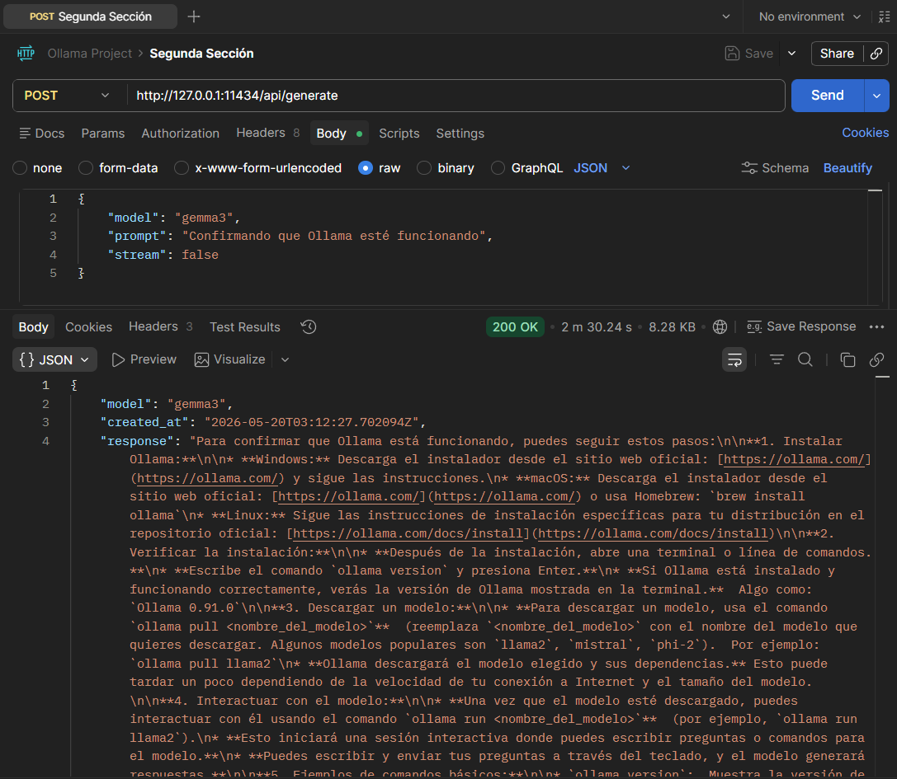
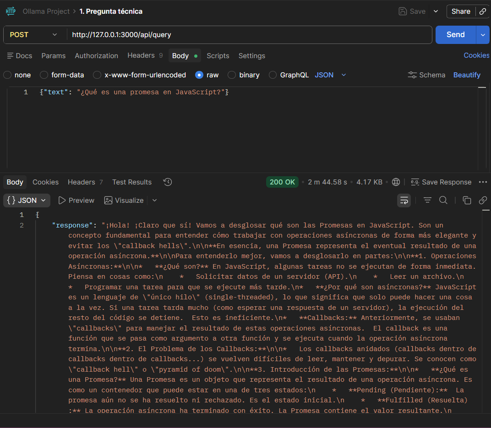
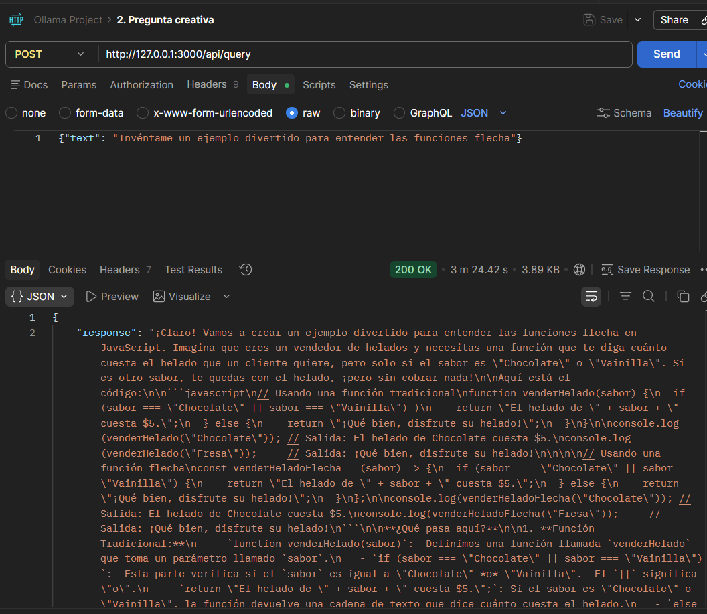
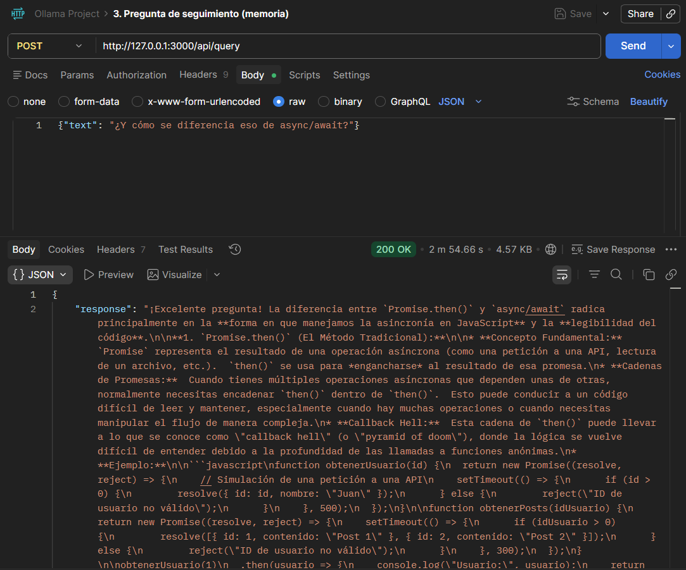

# ollama-project
** Mi primer servidor con Ollama (NodeJS y TypeScript) **

## Instalando modelo de Ollama - gemma3 desde el PowerShell

## Confirmando que el modelo de gemma3 se haya instalado apropiadamente

## Confirmando que ollama

----------------------------------------------------------------------------------

## Segunda Sección - Integración con Ollama

## Tercera Sección - Creación del servidor inteligente
** Pregunta 1:

** Pregunta 2:

**Pregunta 3:
